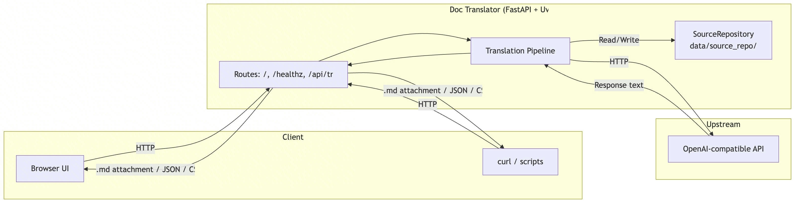
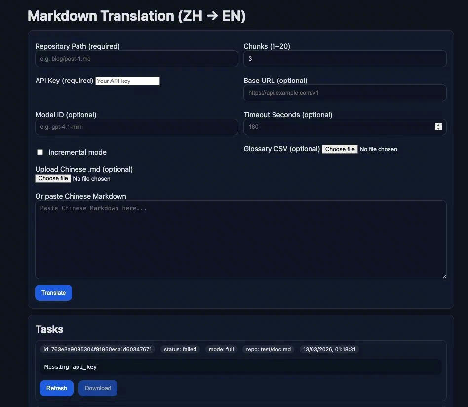
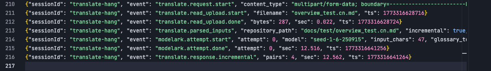

+++
author = "Xiaokai Dong"
title = "Using AI to build a customized translation service"
date = "2026-02-18"
description = "How I used AI to build a customized translation service for the technical documentation development workflow."
tags = [
    "Vibe Coding",
    "Tool",
]
categories = [
    "Vibe Coding",
    "Doc Workflow",
]
image = "header-image-shooting-star.png"
+++

<!--more-->


Part of my day-to-day work is translating and localizing Chinese technical content into English. Along the way, content also needs to be adapted for different external and internal publishing channels. For a long time, that work lived in a more traditional internationalization (i18n) workflow, and over time it became a pain point for both writers and translators.

As our documentation workflow moved toward a doc-as-code and highly automated model, it became clear that the old translation approach no longer fit the way we worked.

What I needed was something that could plug into the new workflow more naturally—no heavy platform or separate manual process, just a service that could work well with Markdown-based files, support future automation, and save translators from repetitive formatting cleanup.

So I built one with AI.

This post is a simple write-up of how I approached it, what worked well, what needed debugging, and what I would handle more carefully next time.

## Why I wanted to build it

The main problem was not translation quality alone. It was workflow fit.

Our docs were moving toward a doc-as-code setup, which meant content was increasingly managed like source code: Markdown files, versioning, iterative updates, and developer-style tooling. In that setup, translation also needed to become more structured.

I wanted a service that could do a few practical things:

- translate Markdown into English
- preserve formatting as much as possible
- support incremental translation instead of retranslating everything every time
- expose both an API and a simple web UI, so it can be integrated easily into the pipeline while also supporting quick ad hoc tasks

## Setup

The setup was pretty simple:

- a LLM model service
- a coding agent, in my case [Trae](https://www.trae.ai/)
- a virtual machine, either on company cloud or public cloud. Tools like Trae can connect to the machine and build the service there

The idea was not to hand-code everything myself from scratch, but to define the problem clearly enough that AI could generate most of the implementation, while I focused on reviewing, debugging, and refining it.

That worked better than I expected.

## Define the core functions

Before asking AI to write anything, I wrote down the core functions I wanted, mostly from an end-user perspective.

The most important ones were:

- Markdown translation
- format preserving
- incremental translation support
- API
- web UI

Once the functions were clear, the rest became much easier. Without that clarity, AI tends to produce something that looks complete at first glance but misses the details that actually matter in real use.

For example, “translate Markdown” sounds simple, but in practice it means much more than just translating text. You need to think about what should not be touched, how formatting is preserved, how files are handled, and how the translated result can still fit into your content workflow.

That kind of thinking is still very much human work.

One thing I learned afterward is that it helps a lot to define the logic of customized features early. In this case, that meant incremental translation. At first, the customized logic was not clearly defined, so AI used a more traditional translation memory mechanism, which did not fit the requirement. I then worked through a specific logic that suited my scenario and asked AI to rebuild the service around it.

## Turn functional requirements into a PRD

The original functional spec was simple. It described what I needed in plain English.

To turn that into a more standard product requirement document (PRD) that a developer could execute, I sent it to GPT and asked the model to rewrite it into a more detailed prompt.

The rewritten prompt was much more structured. It spelled out:

- the expected features
- the input and output behavior
- the architecture expectations
- the constraints around formatting
- the basic interaction model for the API and UI

The original version looked good but was too long, so I asked the model to simplify it.

You can check the prompt here: [prompt.md](https://drive.google.com/file/d/1A6QRdk2E3WyYFYgXY4nYoufzrkO-Zd0g/view?usp=drive_link)

GPT helped me move from “what I want” to “what an AI builder can execute more reliably.”

## Let the coding agent build

After that, I passed the PRD prompt to TRAE, and it generated some design documents first, including the architecture diagram, the API spec, and the UI design.

Below is the architecture diagram:



Next, the actual building work began, and around 20 minutes later, it delivered a usable version.

Instead of spending a long time wiring together the first usable version by hand, I already had something functional to test.

It was not perfect, but it was close enough that the remaining work became much more about refinement than initial construction.

That is one of the most useful things AI can do in this kind of project: it can get you to the first 60% or even 80% much faster, especially when the product shape is already clear.



````
curl -sS -X POST "http://localhost:8080/api/translate" \
-F repository_path="docs/test/overview_test.cn.md" \
-F incremental=true \
-F output_format=md \
-F output_filename="test.changed.md" \
-F updated_file=@overview_test.cn.md \
-o test.changed.md
````

## Debugging and refining

Next came the real work: bug fixing and refinement. This still required a lot of human judgment.

Although the UI already looked good, a number of functional details needed to be corrected and improved.

I had to go through rounds of:

- debugging
- refining logic
- updating behavior
- checking whether the implementation matched the actual workflow needs

This was especially important for architecture and logic.

AI can generate a lot of code quickly, but if you do not review the structure carefully, future debugging becomes painful. It is easy to end up with something that works once but is hard to extend.

So I spent time understanding what the AI wrote:

- how requests flowed through the service
- how translation logic was organized
- where format handling happened
- how future changes could be added without breaking everything

That review step made later improvements much easier.

Another important aspect was testing. I asked AI to write test cases for each fix it made so I could use them later for regression testing. It also set up a debugging server that could output logs in real time.



## Integrate the service into the workflow

Once the service itself was in a decent state, I took one more step: I turned the API usage into a skill that could be used inside the IDE.

This made the service much more practical in daily work.

Instead of treating it as a standalone side tool, it became something closer to a workflow capability. That is usually the point where a tool starts to become genuinely useful—when it stops being “a project I built” and starts becoming “something I can actually use repeatedly with low friction.”

## Lessons learned

A few lessons stood out pretty clearly.

### 1. Plan the functions carefully before asking AI to build

This was the biggest one.

If the functional design is vague, AI will still generate something, but it will often fill in important gaps with assumptions that may not match what you want.

For this kind of tool, I found it much more effective to spend more time on:

- what the service should do
- what the boundaries are
- what inputs and outputs should look like
- what future workflow it should fit into

Interestingly, I worried less about implementation details at the beginning. AI was actually pretty helpful there. The harder part was defining the problem correctly.

### 2. Read the architecture, not just the feature list

If the generated tool seems to work, it is tempting to move on immediately.

But I think it is worth slowing down and checking the architecture and logic written by AI. That pays off later when you need to debug or add features.

In my case, reviewing the code structure made it easier to:

- fix issues faster
- understand where certain behavior came from
- prepare the service for later updates

It also reduced the feeling of losing control over the system.

### 3. AI can do more than expected

It is worth thinking broadly about what AI can help with, because it can support almost every stage of the work. No ideas yet? No deep knowledge of architecture, coding, interfaces, or pipelines? AI can still help move things forward.

A good place to start is simply asking for ideas or possible solutions first.

And when problems come up—even problems created by AI—you can still turn to AI, or another model, for help.

It is easy to stay on the existing path, even when that path is obviously inefficient. AI makes it much easier to challenge that habit and build a better one.

### 4. AI is very good at acceleration, but not at ownership

This project reminded me that AI can help a lot with building, but it does not remove the need for someone to own the result.

It can generate code, but it does not automatically understand my workflow as well as I do.

It does not know which tradeoffs matter most. It does not know what will become a maintenance problem later. And it does not know which rough edge is acceptable and which one will break real usage.

That part still belongs to the person building the service.

## Next steps

The next step is to add CI/CD so the service is easier to maintain over time. That feels like the natural continuation of the whole project.

Once a translation service becomes part of a doc-as-code workflow, it should also be maintained with a doc-as-code mindset: versioned, testable, and easier to update safely.

So while the first phase was about building the service, the next phase is really about making it easier to keep alive.

## Final thoughts

This project was a good reminder that AI is especially useful when the problem is already well understood.

I did not start with “let’s see what AI can build.” I started with a real workflow problem, a fairly clear set of requirements, and a practical need inside documentation work.

From there, AI helped me move much faster.

The most useful pattern for me was:

- Be a PM to define the problem clearly and use AI to turn rough requirements into a better build prompt
- Let the agent act like both architect and developer to design the technical spec and implement it
- Be a QA lead to drive the debugging and refinement until it fits real use

If you work in documentation, localization, or internal tooling, this kind of approach is definitely worth trying.
