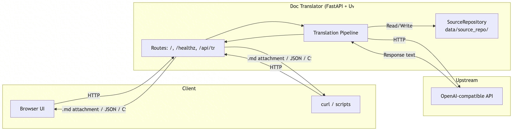
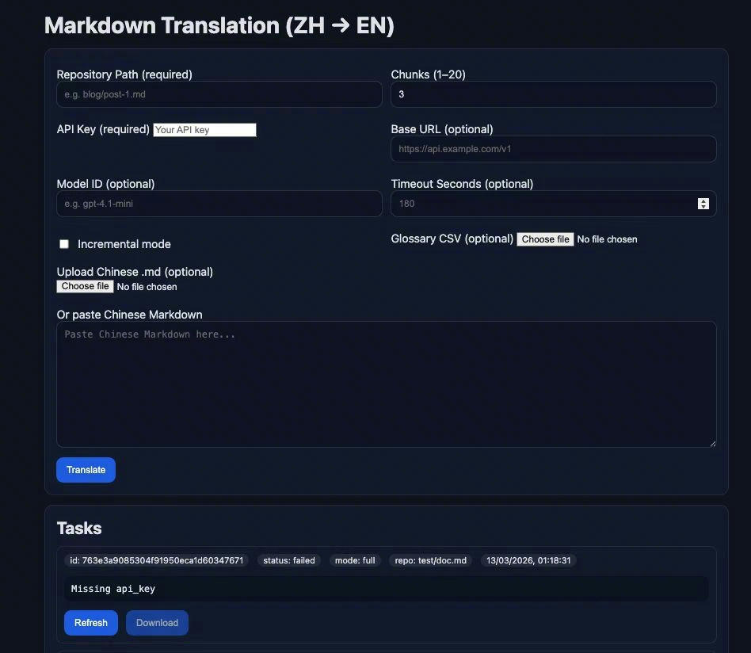
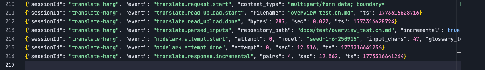
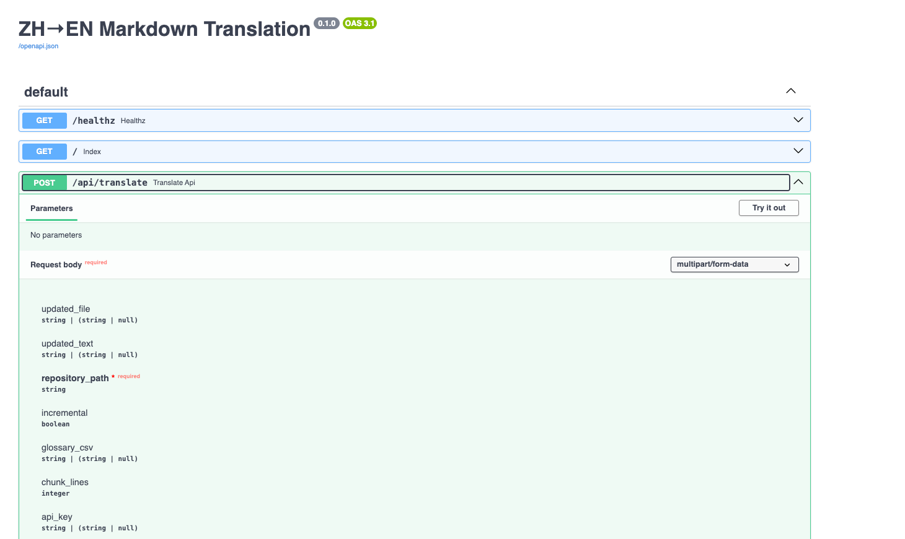

+++
author = "Xiaokai Dong"
title = "用 AI 构建定制化翻译服务"
date = "2026-02-18"
description = "通过 Vibe Coding 构建一个适配真实技术文档开发流程的定制化翻译服务。"
tags = [
    "Vibe Coding",
    "Tool",
]
categories = [
    "Vibe Coding",
    "Doc Workflow",
]
image = "header-image-shooting-star.png"
+++

<!--more-->


我的日常工作中有一部分是把中文技术内容翻译和本地化成英文。在这个过程中，内容还需要适配不同的外部和内部发布渠道。很长一段时间里，这项工作都沿用比较传统的国际化（i18n）流程。久而久之，它逐渐成了写作者和译者共同的痛点。

随着我们的文档流程逐渐转向 doc-as-code 和高度自动化的模式，我越来越明显地感受到，旧的翻译方式已经不适合新的工作方式了。

我需要的是一个能更自然地接入新流程的工具：不需要厚重的平台，也不需要额外的人工流程；它只要能很好地处理基于 Markdown 的文件，支持未来的自动化，并让译者少做一些重复的格式整理工作。

所以，我用 AI 做了一个。

这篇文章简单记录一下我是怎么做的，哪些地方效果不错，哪些地方需要调试，以及如果重来一次，我会更谨慎处理什么。

## 为什么想做这个工具

核心问题并不只是翻译质量，而是工作流适配。

我们的文档正在转向 doc-as-code 模式，也就是说，内容越来越像源码一样被管理：Markdown 文件、版本控制、持续迭代，以及开发者风格的工具链。在这种模式下，翻译也需要变得更加结构化。

我希望这个服务能完成几个实际任务：

- 将 Markdown 翻译成英文
- 尽可能保留格式
- 支持增量翻译，而不是每次都重新翻译全部内容
- 同时提供 API 和简单的 Web UI，这样既方便接入流水线，也方便处理临时任务

## 准备工作

准备过程很简单：

- 一个大语言模型服务
- 一个编码 Agent，我用的是 [Trae](https://www.trae.ai/)
- 一台虚拟机，可以是公司云或公有云。Trae 这类工具可以连接到机器上，并在那里构建服务

我的思路不是从零开始手写所有代码，而是先把问题定义得足够清楚，让 AI 生成大部分实现，然后我负责审查、调试和打磨。

实际效果比我预想的更好。

## 定义核心功能

在让 AI 写任何东西之前，我先从终端用户的角度写下了自己想要的核心功能。

最重要的几个功能是：

- Markdown 翻译
- 格式保留
- 增量翻译支持
- API
- Web UI

功能明确之后，后面的事情就顺了很多。如果一开始没有这层清晰度，AI 往往会生成一个乍看很完整的东西，但会漏掉真正使用时最关键的细节。

比如，“翻译 Markdown”听起来很简单，但实际远不止把文本翻译一遍。你需要考虑哪些内容不能动，格式怎么保留，文件怎么处理，以及翻译后的结果怎样才能继续适配原来的内容流程。

这类思考仍然非常需要人的判断。

后来我还意识到，尽早定义定制功能的逻辑非常重要。在这个项目里，这个定制逻辑就是增量翻译。一开始，我没有把这部分逻辑定义清楚，所以 AI 使用了更传统的翻译记忆机制，但这并不符合我的需求。之后我重新梳理了一套更适合这个场景的逻辑，并让 AI 围绕它重构服务。

## 把功能需求整理成 PRD

最初的功能说明很简单，只是用普通英文描述我需要什么。

为了把它变成更标准、可执行的产品需求文档（PRD），我把它发给 GPT，让模型帮我改写成更详细的提示词。

改写后的提示词结构清晰得多，具体说明了：

- 预期功能
- 输入和输出行为
- 架构预期
- 格式处理约束
- API 和 UI 的基本交互方式

原始版本看起来不错，但太长了，所以我又让模型做了精简。

你可以在这里查看提示词：**[prompt.md](https://drive.google.com/file/d/1A6QRdk2E3WyYFYgXY4nYoufzrkO-Zd0g/view?usp=drive_link)**

GPT 帮我完成了从“我想要什么”到“AI 构建工具可以更可靠执行什么”的转换。

## 让编码 Agent 开始构建

之后，我把 PRD 提示词交给 TRAE。它先生成了一些设计文档，包括架构图、API 规范和 UI 设计。

下面是架构图：



接下来开始真正构建。大约 20 分钟后，它交付了一个可用版本。

我没有花很长时间手动拼出第一个可用版本，而是直接得到了一套可以测试的东西。

它并不完美，但已经足够接近目标。剩下的工作更多是打磨，而不是从零开始搭建。

这也是 AI 在这类项目里最有价值的地方之一：当产品形态已经比较清楚时，它能更快地把你带到最初的 60% 甚至 80%。



````
curl -sS -X POST "http://localhost:8080/api/translate" \
-F repository_path="docs/test/overview_test.cn.md" \
-F incremental=true \
-F output_format=md \
-F output_filename="test.changed.md" \
-F updated_file=@overview_test.cn.md \
-o test.changed.md
````

## 调试和打磨

接下来才是真正的工作：修 bug 和持续打磨。这部分仍然需要大量人的判断。

虽然 UI 看起来已经不错，但很多功能细节还需要修正和改进。

我需要反复做这些事情：

- 调试
- 优化逻辑
- 更新行为
- 检查实现是否符合真实工作流需求

这在架构和逻辑层面尤其重要。

AI 可以很快生成大量代码，但如果不仔细审查结构，后续调试会变得很痛苦。很容易得到一个“能跑一次”的东西，但它很难扩展。

所以我花时间理解 AI 写出来的内容：

- 请求在服务中如何流转
- 翻译逻辑如何组织
- 格式处理在哪里发生
- 以后如何在不破坏整体结构的情况下增加新功能

这一步让后续改进容易了很多。

另一个重要方面是测试。每次 AI 修复问题时，我都会让它为对应修复编写测试用例，这样之后可以用于回归测试。它还搭建了一个调试服务器，可以实时输出日志。



## 把服务集成进工作流

服务本身达到一个比较可用的状态之后，我又往前走了一步：把 API 的使用方式做成了一个可以在 IDE 中调用的 skill。

这让服务在日常工作中实用得多。

它不再只是一个独立的小工具，而更像是一种工作流能力。通常只有到了这个阶段，一个工具才会真正变得有用：它不再是“我做过的一个项目”，而是“我可以低摩擦地反复使用的东西”。

## 经验总结

有几条经验对我来说很明显。

### 1. 让 AI 开始构建之前，先认真规划功能

这是最重要的一点。

如果功能设计很模糊，AI 仍然会生成东西，但它经常会用自己的假设填补关键空白，而这些假设不一定符合你的真实需求。

对这类工具来说，我发现把更多时间花在下面这些问题上更有效：

- 服务应该做什么
- 边界在哪里
- 输入和输出应该是什么样
- 它未来要接入怎样的工作流

有意思的是，最开始我并没有太担心实现细节。AI 在这方面其实很有帮助。更难的部分是正确地定义问题。

顺便说一句，当我优化 PRD 提示词并重新尝试构建流程时，AI 一次性生成的功能比第一次完整得多。它甚至按照 OpenAPI 文档标准生成了面向用户的 API 文档。



### 2. 不要只看功能列表，也要读架构

如果生成出来的工具看起来能用，人很容易立刻往下走。

但我觉得值得慢下来，检查 AI 写出的架构和逻辑。等到之后需要调试或添加功能时，这一步会带来回报。

在我的例子里，审查代码结构让我更容易：

- 更快修复问题
- 理解某些行为来自哪里
- 为之后更新服务做好准备

它也减少了那种“对系统失去控制”的感觉。

### 3. AI 能做的比预期更多

值得更开放地思考 AI 能帮什么，因为它几乎可以支持工作的每个阶段。还没有想法？不熟悉架构、编码、界面或流水线？AI 仍然可以推动事情向前走。

一个不错的起点就是先让它给出想法或可能方案。

当问题出现时，即使这些问题是 AI 造成的，你也仍然可以继续向 AI 或另一个模型求助。

我们很容易停留在既有路径上，即使那条路径明显低效。AI 让挑战旧习惯、建立新方式变得容易很多。

### 4. AI 很擅长加速，但不等于负责到底

这个项目提醒我，AI 在构建方面能帮很多忙，但它并不会取代人对结果负责。

它可以生成代码，但不会自动像我一样理解我的工作流。

它不知道哪些取舍最重要，不知道什么以后会变成维护问题，也不知道哪个粗糙边缘可以接受、哪个会影响真实使用。

这些仍然属于构建者。

## 下一步

下一步是加入 CI/CD，让服务更容易长期维护。这感觉像是整个项目自然的延续。

当翻译服务成为 doc-as-code 工作流的一部分时，它本身也应该用 doc-as-code 的思路维护：可版本化、可测试，并且更容易安全更新。

所以，第一阶段是把服务做出来，而下一阶段其实是让它更容易活下去。

## 最后的想法

这个项目很好地提醒了我：当问题已经被充分理解时，AI 尤其有用。

我并不是从“看看 AI 能做出什么”开始的。我是从一个真实的工作流问题、一组比较清晰的需求，以及文档工作中的实际需要开始的。

在这个基础上，AI 帮我快了很多。

对我来说，最有用的模式是：

- 像 PM 一样定义清楚问题，并用 AI 把粗略需求变成更好的构建提示词
- 让 Agent 像架构师和开发者一样设计技术方案并实现它
- 像 QA Lead 一样推动调试和打磨，直到它适配真实使用

如果你从事文档、本地化或内部工具相关工作，这种方式很值得一试。
