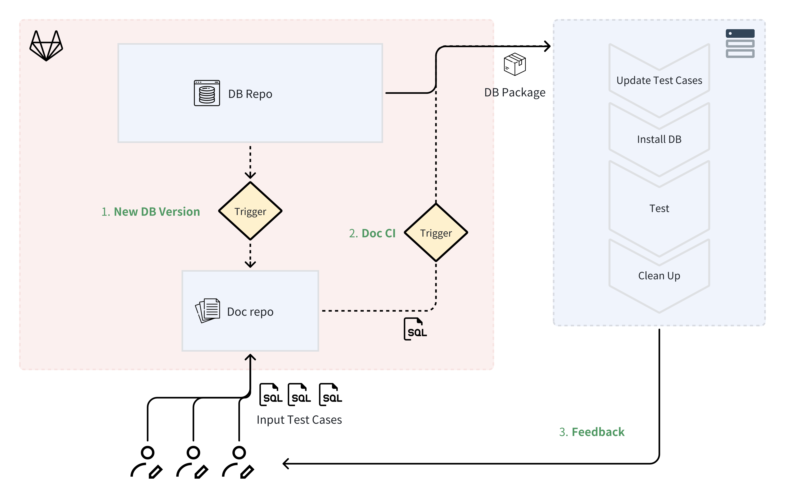

+++
author = "Hugo Authors"
title = "Automate testing in the technical documentation workflow"
date = "2025-08-27"
description = "Sample article showcasing basic Markdown syntax and formatting for HTML elements."
tags = [
    "markdown",
    "css",
    "html",
    "themes",
]
categories = [
    "aaa",
]
series = ["Themes Guide"]
aliases = ["migrate-from-jekyl"]
image = "pawel-czerwinski-8uZPynIu-rQ-unsplash.jpg"
+++

This article offers a sample of basic Markdown syntax that can be used in Hugo content files, also it shows whether basic HTML elements are decorated with CSS in a Hugo theme.
<!--more-->

# Automate testing in the technical documentation workflow

Keeping technical documentation up‑to‑date is a challenging task. It requires a mechanism to detect discrepancies between the product and the documentation. Without a procedural guarantee, existing docs can be overlooked, since documenting new features takes priority.

One advantage of doc-as-code is that it brings documentation closer to the product code, thereby making it more likely to be built and tested automatically. 

## Background

I worked as a technical writer at a database company last year. Occasionally, code updates would break key procedures described in the documentation. 

As we just shifted the docs to Gitlab and started adopting a doc-as-code workflow, I experimented with an automation testing pipeline inspired by our development team’s CI (Continuous Integration), which automatically runs database regression tests on a VM whenever an update was pushed to the main branch.

This is not a step-by-step tutorial but more of a project summary, as the process contains steps that only apply to a certain type of database docs. But I think the idea can be generalized and potentially applied to doc workflows facing similar maintenance issues.

## What is CI?

If you’re unfamiliar with [Continuous Integration (CI)](https://en.wikipedia.org/wiki/Continuous_integration), it's a process that allows developers to merge changes into the main codebase frequently. CI includes automated tests that verify the changes and ensure no conflicts arise.

In addition, my project leverages the PostgreSQL regression testing tool, [`pg_regress`](https://www.postgresql.org/docs/current/regress.html), to do the actual testing work. With `pg_regress` you simply create test cases in SQL; the tool runs them and returns the results and debugging information.

## Flow

Here’s how the automation test works:



````
DB updated → CI pipeline triggered → (In VM) Pull test cases → 
Install the latest DB →  Run the tests → 
Return test results → Clean up the env
````

Below is a breakdown of how it was established:

## Prerequisites

Setting up a full test framework or pipeline from scratch isn’t realistic. So this trial relies on a few prerequisites:
- Your development team already has a CI pipeline.
- Test cases are not difficult to be created. In my case, the test tool uses SQL syntax, which isn’t too complex for a database tech writer.
- You have access and permissions to required resources (e.g., VM creation in the dev/test environment).

## Step 1: Set up a VM for testing

First, you need an environment to run tests. For my case, the pipeline uses `pg_regress` to execute SQL scripts on a live database. So I needed a VM where the pipeline could install the latest DB, add test cases, and run the tests.

With the help of a test engineer, I got a script that set up and initializes the regression test flow. (This can be done by a writer too, through reading the code of the test pipeline. But it would take much longer.)

You’ll need to check with your dev team about how they manage test environments and mirror the configuration and the launch method. 

## Step 2: Prepare the test script

Next, you’ll need to create a script to do the actual job. The Gitlab CI will pick up and execute the script when the condition you predefined is met. 

My script does the following:

1. Download test cases from the documentation GitLab repo and move them to the specified folder in the VM.  
   Example code:

    ````shell
      INPUT_DIR="[source_sql_directory]"
      EXPECTED_DIR="[source_expected_output_directory]"
      SQL_DIR="[destination_sql_directory]"
      EXPECTED_DEST_DIR="[destination_expected_output_directory]"
      DEBUG_SCHEDULE="[test_schedule_file]"


      # Move source .sql files and update debug_schedule
      move_and_update_sql() {
        local src_dir=$1
        local dest_dir=$2

        for file in "$src_dir"/*; do
          [ -f "$file" ] || continue  # Skip if not a file

          file_name=$(basename "$file")
          file_base_name="${file_name%.*}"  # Strip the file extension

          if [ ! -f "$dest_dir/$file_name" ]; then
            mv "$file" "$dest_dir/"
            echo "test: $file_base_name" >> "$DEBUG_SCHEDULE"
            echo "Moved $file_name to $dest_dir and updated debug_schedule."
          fi
        done
      }

      # Move source expected output files
      move_and_update_expected() {
        local src_dir=$1
        local dest_dir=$2

        for file in "$src_dir"/*; do
          [ -f "$file" ] || continue  # Skip if not a file

          file_name=$(basename "$file")

          if [ ! -f "$dest_dir/$file_name" ]; then
            mv "$file" "$dest_dir/"
            echo "Moved $file_name to $dest_dir."
          fi
        done
      }

      move_and_update_sql "$INPUT_DIR" "$SQL_DIR"
      move_and_update_expected "$EXPECTED_DIR" "$EXPECTED_DEST_DIR"
    ````

2. Download and install the latest database version. 

    ````shell
      url="[DB_install_package]"
      filename=$(basename "$url")
      wget "$url"
      rpm -ivh "$filename"
    ````

3. Run the tests and print the results.
4. Clean up the environment.

## Step 3: Register a GitLab Runner

GitLab uses runners to execute CI/CD tasks in a given env defined in the `.gitlab-ci.yml` file in each repo. You define how the runner is triggered and what it would do in your test env.

1. Install GitLab Runner on the VM:

    ````shell
      # Add the GitLab Runner repository
      curl -L https://packages.gitlab.com/install/repositories/runner/gitlab-runner/script.deb.sh | sudo bash

      # Install GitLab Runner
      sudo apt-get update
      sudo apt-get install -y gitlab-runner
    ````

2. Register the Runner:
    1. Get a registration token from your GitLab project: **Settings > CI/CD > Runners > Expand "Set up a specific Runner manually"**.
    2. On the VM, run: `sudo gitlab-runner register`, then follow the prompts to complete the registration:
        - GitLab instance URL: e.g., [https://gitlab.com](https://gitlab.com) or your self-hosted instance
        - Registration token: from the UI
        - Description: a name to identify the runner
        - Tags: optional
        - Executor: enter `shell` 

## Step 4: Create a .gitlab-ci.yml File

This file defines your CI pipeline. Place it in the root of your documentation repo. You need to put the script you created in Step 2 to the `script` section in the yml file.


````yml
  stages:
    - test
  centos7:x86_64:icw:
    stage: test      
    script: |
      - echo "Running tests"
      # Add the script here      
    rules:
      - changes:
        - test_case/**/*
    timeout: 8 hours
    allow_failure: false
    variables:
      CI_DEBUG_TRACE: "true"
````

By now, the pipeline has been built up. The next thing is to create test cases and get the pipeline run when DB is updated!

## Write the test cases

`pg_regress` makes it simple to write tests. For each test case, it requires two files:
- A `.sql` file that contains the SQL commands to be run
- A `.out` file that contains the expected output

To verify the test cases:
- Check `regression.diffs` to compare expected vs actual output (watch out for extra spaces at line edges).
- Inspect test output in the `results` folder.

After a test case is created, you can just add them to the doc repo, the pipeline will automatically pick them up when triggered.

## Wrap-up

By this point, the initial version of the test pipeline is set up. The last thing is to set a proper trigger for the pipeline, for example, when the new DB version is out, the pipeline is triggered and also pulls the URL to the new DB’s installation package.

This pipeline is far from perfect and could be improved in all aspects. It’s just a proof-of-concept of a development-styled test process for docs. When manual maintenance becomes unmanageable, it's worth trying to set up such an automation to help.

Improving points:

1. AI could be leveraged to convert existing tutorials into test cases, which would significantly expand the scope of the test.
2. Enterprise databases often integrate with broader architectures (e.g., Hadoop or Hive). If the workflow can set up environments for those integration use cases, more complex tutorials could be included in the testing.