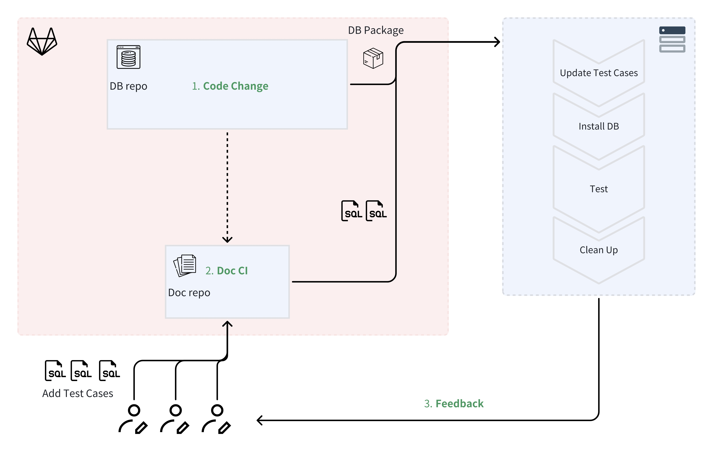

+++
author = "Xiaokai Dong"
title = "在技术文档工作流中自动化测试"
date = "2025-08-27"
description = "构建一个实验性的 CI 流水线，用于测试数据库文档，并防止产品变更导致文档失效。"
tags = [
    "Test",
    "Automation",
]
categories = [
    "Doc Workflow",
]
image = "header_image_by_gpt.png"
+++

<!--more-->

让技术文档保持最新是一件很有挑战的事。它需要一种机制来发现产品和文档之间的不一致。如果没有流程保障，已有文档很容易被忽略，因为记录新功能通常会被放在更高优先级。

doc-as-code 的一个优势是，它让文档更接近产品代码，因此也更有机会被自动构建和自动测试。

## 背景

去年我在一家数据库公司做技术写作。偶尔，代码更新会导致文档中描述的关键操作流程失效。

当时我们的文档刚迁移到 GitLab，并开始采用 doc-as-code 工作流。我尝试搭建了一套自动化测试流水线，灵感来自研发团队的 CI（Continuous Integration）流程：每当代码更新推送到主分支时，CI 会自动在虚拟机上运行数据库回归测试。

这篇文章不是逐步教程，更像是一个项目总结，因为其中有些步骤只适用于特定类型的数据库文档。但我认为这个思路可以被泛化，也可能适用于面临类似维护问题的文档工作流。

## 什么是 CI？

如果你不熟悉 [Continuous Integration（CI）](https://en.wikipedia.org/wiki/Continuous_integration)，它是一种让开发者频繁将变更合并到主代码库的流程。CI 通常包含自动化测试，用于验证变更并确保不会产生冲突。

此外，我的项目使用 PostgreSQL 回归测试工具 [`pg_regress`](https://www.postgresql.org/docs/current/regress.html) 来完成实际测试。使用 `pg_regress` 时，只需要用 SQL 创建测试用例；工具会运行它们，并返回结果和调试信息。

## 流程

自动化测试的流程如下：



````
数据库更新 → 触发 CI 流水线 →（在 VM 中）拉取测试用例 → 安装最新数据库 → 运行测试 → 返回测试结果 → 清理环境
````

下面是搭建过程的分解说明：

## 前置条件

从零开始搭建完整的测试框架或流水线并不现实。所以这次尝试依赖几个前置条件：

- 你的研发团队已经有 CI 流水线。
- 测试用例不难创建。在我的场景中，测试工具使用 SQL 语法。
- 你拥有所需资源的访问权限。

## 第 1 步：为测试准备一台 VM

首先，你需要一个运行测试的环境。在我的场景中，流水线使用 `pg_regress` 在真实数据库上执行 SQL 脚本。所以我需要一台 VM，流水线可以在里面安装最新数据库、添加测试用例并运行测试。

在测试工程师的帮助下，我拿到了一个用于搭建和初始化回归测试流程的脚本。（技术写作者也可以通过阅读测试流水线代码来完成这件事，但会花更长时间。）

你需要和研发团队确认他们如何管理测试环境，并尽量镜像对应的配置和启动方式。

## 第 2 步：准备测试脚本

接下来，你需要创建一个脚本来完成实际工作。当预定义条件满足时，GitLab CI 会拾取并执行这个脚本。

我的脚本主要做这些事：

1. 从文档 GitLab 仓库下载测试用例，并把它们移动到 VM 中指定目录。  
   示例代码：

    ````shell
      INPUT_DIR="[source_sql_directory]"
      EXPECTED_DIR="[source_expected_output_directory]"
      SQL_DIR="[destination_sql_directory]"
      EXPECTED_DEST_DIR="[destination_expected_output_directory]"
      DEBUG_SCHEDULE="[test_schedule_file]"


      # Move source .sql files and update debug_schedule
      move_and_update_sql() {
        local src_dir=$1
        local dest_dir=$2

        for file in "$src_dir"/*; do
          [ -f "$file" ] || continue  # Skip if not a file

          file_name=$(basename "$file")
          file_base_name="${file_name%.*}"  # Strip the file extension

          if [ ! -f "$dest_dir/$file_name" ]; then
            mv "$file" "$dest_dir/"
            echo "test: $file_base_name" >> "$DEBUG_SCHEDULE"
            echo "Moved $file_name to $dest_dir and updated debug_schedule."
          fi
        done
      }

      # Move source expected output files
      move_and_update_expected() {
        local src_dir=$1
        local dest_dir=$2

        for file in "$src_dir"/*; do
          [ -f "$file" ] || continue  # Skip if not a file

          file_name=$(basename "$file")

          if [ ! -f "$dest_dir/$file_name" ]; then
            mv "$file" "$dest_dir/"
            echo "Moved $file_name to $dest_dir."
          fi
        done
      }

      move_and_update_sql "$INPUT_DIR" "$SQL_DIR"
      move_and_update_expected "$EXPECTED_DIR" "$EXPECTED_DEST_DIR"
    ````

2. 下载并安装最新数据库版本。

    ````shell
      url="[DB_install_package]"
      filename=$(basename "$url")
      wget "$url"
      rpm -ivh "$filename"
    ````

3. 运行测试并打印结果。
4. 清理环境。

    *第 3 步和第 4 步的示例代码省略，因为它们只适用于具体的数据库服务。*

## 第 3 步：注册 GitLab Runner

GitLab 使用 Runner 在每个仓库的 `.gitlab-ci.yml` 文件中定义的环境里执行 CI/CD 任务。你需要定义 Runner 如何被触发，以及它会在测试环境中做什么。

1. 在 VM 上安装 GitLab Runner：

    ````shell
      # Add the GitLab Runner repository
      curl -L https://packages.gitlab.com/install/repositories/runner/gitlab-runner/script.deb.sh | sudo bash

      # Install GitLab Runner
      sudo apt-get update
      sudo apt-get install -y gitlab-runner
    ````

2. 注册 Runner：
    1. 从 GitLab 项目中获取注册 token：**Settings > CI/CD > Runners > Expand "Set up a specific Runner manually"**。
    2. 在 VM 上运行 `sudo gitlab-runner register`，然后按照提示完成注册：
        - GitLab instance URL：例如 [https://gitlab.example.com](https://gitlab.example.com)
        - Registration token：来自 UI
        - Description：用于识别 Runner 的名称
        - Tags：可选
        - Executor：输入 `shell`

## 第 4 步：创建 .gitlab-ci.yml 文件

这个文件定义 CI 流水线。把它放在文档仓库的根目录下。你需要把第 2 步创建的脚本放到 yml 文件的 `script` 部分。


````yml
  stages:
    - test
  centos7:x86_64:icw:
    stage: test      
    script: |
      - echo "Running tests"
      # Add the script here      
    rules:
      - changes:
        - test_case/**/*
    timeout: 8 hours
    allow_failure: false
    variables:
      CI_DEBUG_TRACE: "true"
````

到这里，流水线已经搭起来了。下一步就是创建测试用例，并在数据库更新时让流水线运行起来。

## 开发测试用例

`pg_regress` 让编写测试变得比较简单。每个测试用例需要两个文件：

- 一个 `.sql` 文件，包含要执行的 SQL 命令
- 一个 `.out` 文件，包含预期输出

验证测试用例时：

- 检查 `regression.diffs`，比较预期输出和实际输出（注意行首和行尾多余空格）。
- 查看 `results` 文件夹中的测试输出。

测试用例创建后，只要把它们加入文档仓库，流水线在触发时就会自动拾取。

## 总结

到这里，测试流水线的初始版本已经搭建完成。最后要做的是设置合适的触发条件，比如当新的数据库版本发布时触发流水线，并拉取新数据库安装包的 URL。

这条流水线远不完美，方方面面都可以继续改进。它只是一个面向文档的开发风格测试流程的概念验证。当人工维护变得难以管理时，很值得尝试搭建这样的自动化能力来辅助工作。

可以改进的方向：

1. 可以利用 AI 将现有教程转换成测试用例，从而显著扩大测试覆盖范围。
2. 企业数据库经常会和更广泛的架构集成，例如 Hadoop 或 Hive。如果工作流能为这些集成场景搭建环境，就可以把更复杂的教程也纳入测试。
