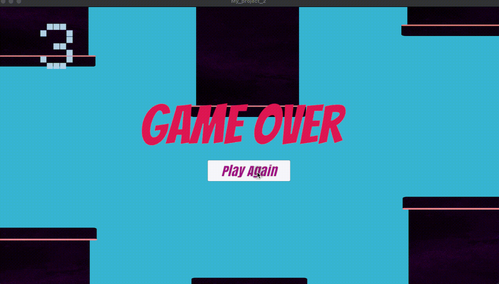

+++
author = "Xiaokai Dong"
title = "Learn Unity basics by making a fun little game"
date = "2025-12-27"
description = "Learn Unity basics by making a little game"
tags = [
    "Unity",
    "Game",
]
categories = [
    "Learn",
]
image = "pawel-czerwinski-8uZPynIu-rQ-unsplash.jpg"
+++

<!--more-->

I spent a few days to learn Unity basics last year. This helpful video series by Code Monkey really helped a lot!

This is the game that I finally made:

Enjoy the awesome video:


