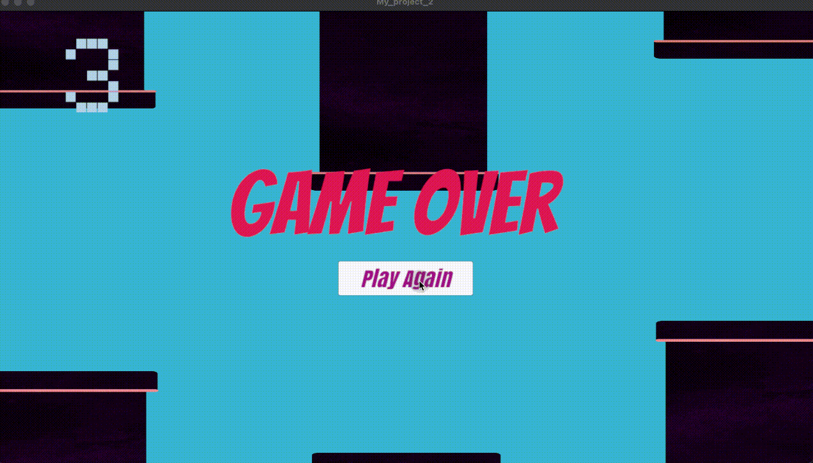

+++
author = "Xiaokai Dong"
title = "Unity 基础"
date = "2025-12-27"
description = "跟随视频教程学习 Unity 基础，并搭建一个小游戏。"
tags = [
    "Unity",
    "Game",
]
categories = [
    "Learning",
]
image = "pawel-czerwinski-8uZPynIu-rQ-unsplash.jpg"
+++

<!--more-->

去年，我花了几天时间学习 Unity 的基础语法和开发流程。在了解基本概念后，我跟着下面的视频教程，搭建了一个简单的 Flappy Bird 风格小游戏。

项目本身并不复杂，但按照步骤完成它，让我可以把刚学到的基础知识实际应用起来。

这是我完成的版本：

我参考的视频教程：


